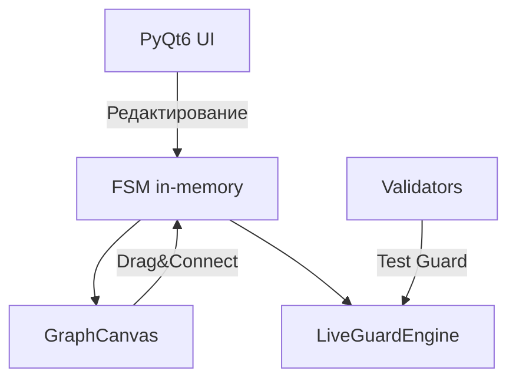

# Project overview

## Архитектура
- `FSMConfiguratorMain` — основное окно и модель FSM (in-memory)
- `GraphCanvas` — визуализация графа состояний (NetworkX + Matplotlib/Qt6)
- `FSMValidator` — проверки целостности и качества FSM
- `LiveGuardEngine` — исполнение guard-условий:
  - `expr:` — вычисление выражения в безопасном окружении с `var.*` и `event.*`
  - `db:` — выполнение SQL на SQLite-источнике из `sources`

## Компоненты и взаимодействия
- `GraphCanvas.on_connect_nodes` вызывает метод `FSMConfiguratorMain._graph_connect_nodes`, который добавляет переход `src -> tgt` в текущую FSM и обновляет граф
- `LiveGuardEngine` использует первый источник с `type=database` и строкой подключения `sqlite:///path/to.db`
- Вкладка Validators содержит тестер guard-условий, который собирает `variables` из текущей FSM и оценивает guard через `LiveGuardEngine`

## Диаграммы

## Формат guard-условий
- `expr: <python-like>` — пример: `expr:event.value >= var.limit`
- `db: <SQL>` — пример: `db:SELECT enabled FROM settings WHERE id=${profile_id}`
  - `\${name}` заменяется на значения из variables/extra
  - Истина: ненулевое число, непустая строка, true-подобные строки

## Экспорт
- Mermaid/PlantUML: переходы включают `id | trigger | [guard] | / actions`

## Требования окружения
- Python 3.10+
- PyQt6, matplotlib>=3.8 (QtAgg/qtagg), networkx
- Для `db:` guards — доступный SQLite-файл по указанному пути 